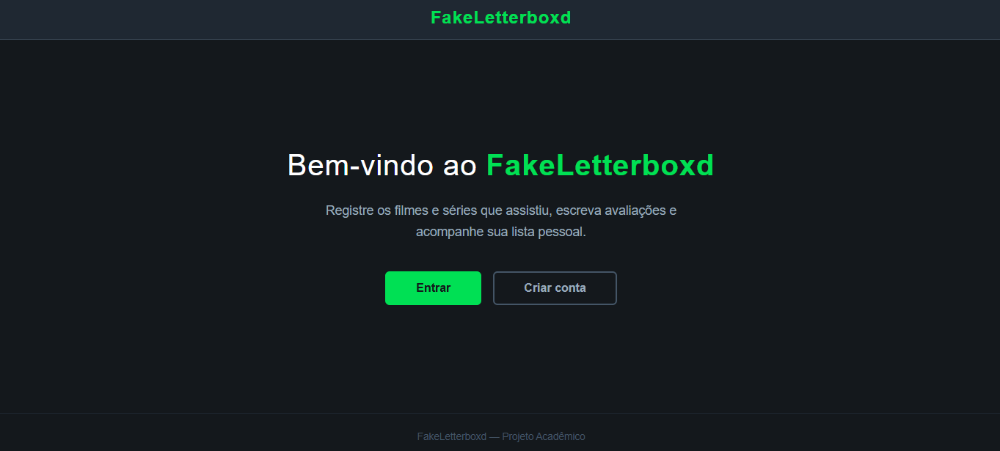
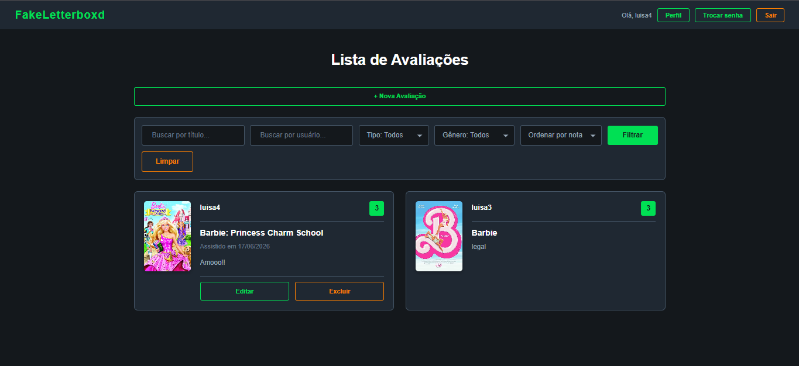
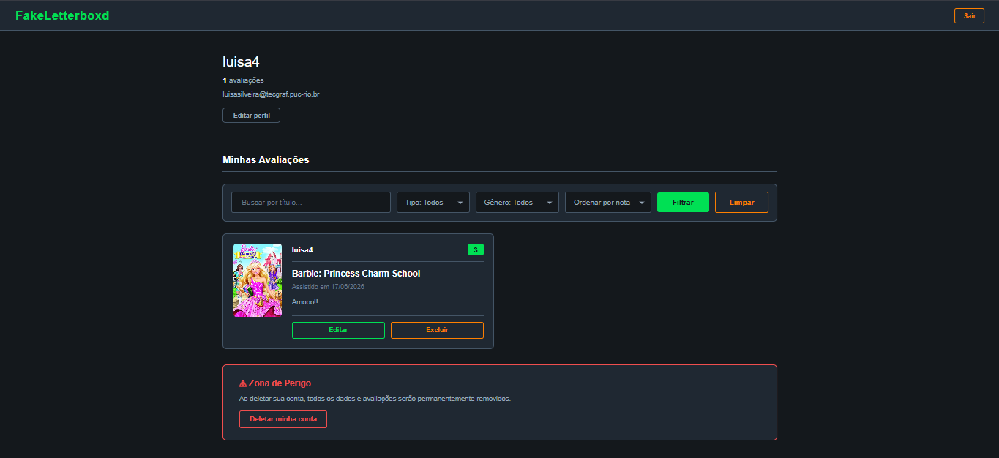

# FakeLetterboxd — Frontend

> Uma plataforma de avaliações de filmes e séries inspirada no Letterboxd, desenvolvida como trabalho acadêmico da disciplina de Programação para Web (INF1407) — PUC-Rio, 2026/1.

**Autores:** Luísa Silveira · Rafael Ribeiro

---

## 🔗 Links

| Recurso | URL |
|---|---|
| Site do Frontend | `<https://fake-letterboxd-two.vercel.app/>` |
| Site do Backend | `https://luisas4.pythonanywhere.com/` |
| Repositório do Frontend | `<https://github.com/LuisaSilveira/inf1407-FakeLetterboxd-Projeto2-Frontend/>` |
| Repositório do Backend | `<https://github.com/LuisaSilveira/inf1407-FakeLetterboxd-Projeto2-Backend>` |

---

## Descrição do Projeto

O **FakeLetterboxd** é um site de avaliações de mídias (filmes e séries) que permite aos usuários cadastrarem suas opiniões, notas e comentários sobre títulos buscados diretamente na base de dados da [OMDb API](https://www.omdbapi.com/). Cada usuário possui uma visão personalizada do sistema: vê apenas suas próprias avaliações no perfil, pode editar e remover somente o que ele mesmo criou, e tem acesso a um painel geral com as avaliações de todos os usuários, com filtros de busca.

O frontend se comunica com um backend Django via API REST, utilizando autenticação JWT (JSON Web Tokens). Todo o código JavaScript foi desenvolvido em **TypeScript** e compilado para JS antes da publicação.

---

## 🖼️ Telas da Aplicação

| Home (não autenticado) | Lista de Avaliações | Perfil do Usuário |
|---|---|---|
|  |  |  |

> As imagens acima se encontram na pasta `screenshots/` do repositório.

---

## Estrutura de Páginas

```
frontend/public/
├── home.html                        # Página inicial (pública)
├── index.html                       # Lista geral de avaliações (protegida)
├── insereReview.html                # Criar nova avaliação (protegida)
├── update.html                      # Editar avaliação (protegida)
├── detalheAvaliacao.html            # Detalhe de uma avaliação (protegida)
├── perfil.html                      # Perfil do usuário (protegida)
├── accounts/
│   ├── login.html                   # Login
│   ├── cadastro.html                # Cadastro de nova conta
│   ├── passwordChange.html          # Trocar senha (protegida)
│   ├── passwordReset.html           # Esqueci minha senha
│   └── passwordResetDone.html       # Confirmação de e-mail enviado
├── css/                             # Folhas de estilo por página
├── javascript/                      # JS compilado a partir do TypeScript
└── img/                             # Ícones (olho, eye-off)
```

---

## ⚙️ Instalação Local

### Pré-requisitos

- [Node.js](https://nodejs.org/) (para compilar o TypeScript, se necessário)
- Qualquer servidor HTTP local (ex: `Live Server` no VS Code, `http-server` via npm, ou Python)

### Passos

```bash
# 1. Clone o repositório
git clone <url-do-repositorio-frontend>
cd inf1407-FakeLetterboxd-Frontend/meu-projeto/frontend

# 2. (Opcional) Recompilar o TypeScript
npm install -g typescript
tsc

# 3. Servir os arquivos estáticos
# Opção A — com Python
cd public
python3 -m http.server 8080

# Opção B — com http-server (npm)
npx http-server public -p 8080

# 4. Acesse no navegador
http://localhost:8080/home.html
```

> **Nota:** O arquivo `typescript/constantes.ts` define o endereço do backend (`backendAddress`). Para apontar para um backend local, altere o valor da constante e recompile.

---

##  Autenticação e Segurança

O sistema utiliza **JWT (JSON Web Tokens)** para autenticação. Os tokens são armazenados no `localStorage` do navegador:

- `access_token` — token de curta duração usado nas requisições autenticadas.
- `refresh_token` — token de longa duração usado para renovar o access token automaticamente quando ele expira.

A função `authFetch` (definida em `typescript/accounts/common.ts`) intercepta toda requisição autenticada, verifica se o access token está expirado, renova-o automaticamente se necessário e adiciona o cabeçalho `Authorization: Bearer <token>`.

### Páginas Protegidas (requerem login)

Ao acessar qualquer uma das páginas abaixo sem estar autenticado, o usuário é **redirecionado automaticamente** para `home.html` ou `accounts/login.html`:

| Página | Arquivo | Descrição |
|---|---|---|
| Lista de Avaliações | `index.html` | Feed geral com avaliações de todos os usuários |
| Nova Avaliação | `insereReview.html` | Formulário para criar avaliação |
| Editar Avaliação | `update.html` | Formulário para editar avaliação própria |
| Detalhe da Avaliação | `detalheAvaliacao.html` | Página de detalhe de uma avaliação específica |
| Perfil | `perfil.html` | Perfil do usuário logado |
| Trocar Senha | `accounts/passwordChange.html` | Formulário de troca de senha |

### Páginas Públicas (sem necessidade de login)

| Página | Arquivo | Descrição |
|---|---|---|
| Home | `home.html` | Apresentação do site |
| Login | `accounts/login.html` | Formulário de login |
| Cadastro | `accounts/cadastro.html` | Criação de nova conta |
| Esqueci a Senha | `accounts/passwordReset.html` | Solicitação de reset de senha |
| Confirmação de Reset | `accounts/passwordResetDone.html` | Aviso de e-mail enviado |

---

## Manual do Usuário

### 1. Cadastro de Conta

1. Acesse `home.html` e clique em **"Cadastre-se"**.
2. Preencha os campos: **usuário**, **e-mail** (deve ser único), **nome**, **sobrenome**, **senha** e **confirmação de senha**.
3. Se as senhas não coincidirem, uma mensagem de erro será exibida.
4. Após o cadastro bem-sucedido, você será redirecionado automaticamente para a página de login.

> O e-mail informado deve ser único no sistema. Tentativas de cadastro com um e-mail já existente resultarão em erro.

---

### 2. Login

1. Acesse `accounts/login.html`.
2. Informe seu **usuário** e **senha**.
3. Clique em **"Entrar"**.
4. Em caso de sucesso, os tokens JWT são salvos no `localStorage` e você é redirecionado para a lista de avaliações (`index.html`).
5. Em caso de falha, a mensagem **"Usuário ou senha inválidos"** será exibida.

---

### 3. Navbar (Cabeçalho)

A barra de navegação está presente em todas as páginas e exibe:

- **Quando autenticado:** nome do usuário logado, links para a lista de avaliações, perfil e logout.
- **Quando não autenticado:** links para login e cadastro.
- **Logo "FakeLetterboxd":** ao clicar, redireciona para `index.html` (lista de todas as avaliações).

---

### 4. Lista de Avaliações (`index.html`) — CRUD: Leitura

Esta é a página principal após o login. Exibe um **feed com todas as avaliações** cadastradas por todos os usuários do sistema.

#### Filtros disponíveis:

| Filtro | Tipo | Descrição |
|---|---|---|
| Título | Texto | Busca por título da mídia |
| Pessoa | Texto | Busca por diretor ou membro do elenco |
| Tipo de mídia | Select | Filme ou Série |
| Gênero | Select | Ação, Drama, Comédia, etc. |
| Ordenar por nota | Select | Crescente ou decrescente |

- Clique em **"Filtrar"** ou pressione **Enter** para aplicar os filtros.
- Clique em **"Limpar"** para resetar todos os filtros.
- Cada card exibe: poster, título, tipo, gênero, nota e autor da avaliação.
- **Clique em qualquer card** para ver o detalhe completo da avaliação.
- Cards de avaliações **próprias** exibem um botão **"Excluir"**. Um modal de confirmação é aberto antes de deletar.

---

### 5. Criar Avaliação (`insereReview.html`) — CRUD: Criação

1. Clique em **"Nova Avaliação"** na navbar.
2. Na seção de busca, digite o nome de um filme ou série e clique em **"Buscar"**. Os resultados vêm da OMDb via backend.
3. Clique em **"Selecionar"** no título desejado. O poster, título e sinopse da mídia são exibidos automaticamente.
4. Caso queira trocar a mídia selecionada, clique em **"Trocar mídia"**.
5. Preencha os campos da avaliação:
   - **Nota** (1 a 5)
   - **Comentário** (texto livre)
   - **Data que assistiu** (campo de data)
6. Clique em **"Salvar Avaliação"**. Após o sucesso, você é redirecionado para a lista de avaliações.

---

### 6. Detalhe da Avaliação (`detalheAvaliacao.html`) — CRUD: Leitura

Ao clicar em qualquer card de avaliação (na lista ou no perfil), você é levado para a página de detalhe, que exibe:

- Poster da mídia
- Título, tipo, gênero, sinopse, diretor, elenco, idioma, país, duração, classificação etária
- Número de temporadas (para séries)
- Média de notas e total de avaliações da mídia no sistema
- Nota e comentário desta avaliação específica
- Autor, data de assistência, data de avaliação e data de última atualização

**Se você for o autor da avaliação**, dois botões serão exibidos:
- **"Editar"** — leva para `update.html` com os dados pré-preenchidos.
- **"Excluir"** — abre modal de confirmação e deleta a avaliação.

---

### 7. Editar Avaliação (`update.html`) — CRUD: Atualização

Acessível apenas para o **autor da avaliação**. A página carrega os dados atuais da avaliação e permite alterar:

- A mídia (via busca OMDb integrada)
- A nota
- O comentário
- A data em que assistiu

Clique em **"Atualizar Avaliação"** para salvar as alterações.

---

### 8. Perfil do Usuário (`perfil.html`)

Exibe os dados do usuário autenticado e **apenas as avaliações feitas por ele**.

#### Funcionalidades do perfil:

- **Visualizar dados:** usuário, e-mail, nome completo e bio.
- **Editar dados:** clique em **"Editar Perfil"** para atualizar e-mail, nome e bio.
- **Total de avaliações:** contador exibido no topo do grid de avaliações.
- **Filtros de avaliações:** mesmos filtros disponíveis na lista geral, mas aplicados apenas sobre as avaliações do usuário.
- **Excluir avaliação:** botão presente em cada card, com modal de confirmação.
- **Trocar senha:** link para `accounts/passwordChange.html`.
- **Excluir conta:** botão **"Deletar Conta"** com modal de confirmação. A conta é permanentemente excluída e os tokens são removidos do `localStorage`.
- **Logout:** botão no perfil e na navbar.

---

### 9. Trocar Senha (`accounts/passwordChange.html`) — Página Protegida

1. Informe a **senha atual**.
2. Informe a **nova senha** e a **confirmação da nova senha**.
3. Se as senhas não coincidirem, uma mensagem de erro é exibida.
4. Após a alteração bem-sucedida, os tokens são removidos do `localStorage` e você é redirecionado para o login.

---

### 10. Esqueci Minha Senha (`accounts/passwordReset.html`)

1. Informe o **e-mail** cadastrado na conta.
2. Clique em **"Enviar"**.
3. Se o e-mail estiver cadastrado no sistema, um link de redefinição será enviado.
4. A página de confirmação (`passwordResetDone.html`) orienta o usuário a verificar sua caixa de entrada.

---

### 11. Logout

- Disponível na **navbar** e na **página de perfil**.
- Remove `access_token` e `refresh_token` do `localStorage`.
- Redireciona para `home.html`.

---

## 🔌 Endpoints do Backend Consumidos

Todos os endpoints são relativos à URL base: `https://luisas4.pythonanywhere.com/`

| Método | Endpoint | Autenticação | Descrição |
|---|---|---|---|
| `POST` | `api/token/` | Não | Obter tokens JWT (login) |
| `POST` | `api/token/refresh/` | Não | Renovar access token |
| `POST` | `accounts/cadastro/` | Não | Criar nova conta |
| `GET` | `accounts/whoami/` | Sim | Obter username do usuário logado |
| `GET` | `accounts/perfil/` | Sim | Obter dados do perfil |
| `PUT` | `accounts/perfil/` | Sim | Atualizar dados do perfil |
| `DELETE` | `accounts/perfil/` | Sim | Deletar conta do usuário |
| `POST` | `accounts/password-reset/` | Não | Solicitar reset de senha por e-mail |
| `PUT` | `accounts/change-password/` | Sim | Trocar senha (autenticado) |
| `GET` | `midias/avaliacao/` | Sim | Listar avaliações (com filtros opcionais) |
| `POST` | `midias/avaliacao/` | Sim | Criar avaliação |
| `GET` | `midias/avaliacao/{id}/` | Sim | Detalhe de uma avaliação |
| `PUT` | `midias/avaliacao/{id}/` | Sim | Atualizar avaliação |
| `DELETE` | `midias/avaliacao/{id}/` | Sim | Deletar avaliação |
| `GET` | `midias/busca-omdb/?busca_midia=` | Sim | Buscar títulos na OMDb via backend |

### Parâmetros de filtro aceitos em `GET midias/avaliacao/`

| Parâmetro | Tipo | Descrição |
|---|---|---|
| `busca_titulo` | string | Filtra por título da mídia |
| `busca_pessoa` | string | Filtra por diretor ou elenco |
| `tipo_midia` | string | `movie` ou `series` |
| `genero_midia` | string | Gênero (ex: `Action`, `Drama`) |
| `ordem_nota` | string | `asc` ou `desc` |

---

## ⚙️ Tecnologias Utilizadas

- **HTML5** — estrutura das páginas
- **CSS3** — estilização (arquivos separados por página)
- **TypeScript** — toda a lógica de frontend (compilado para JS)
- **JWT** — autenticação via `localStorage`
- **Fetch API** — comunicação com o backend
- **OMDb API** (via backend) — busca de filmes e séries


---

##  Organização do Código TypeScript

Cada arquivo `.ts` tem responsabilidade única e bem definida:

| Arquivo | Responsabilidade |
|---|---|
| `constantes.ts` | URL base do backend e interface JWT |
| `accounts/common.ts` | `authFetch`, renovação de token, toggle de senha |
| `accounts/login.ts` | Formulário de login |
| `accounts/cadastro.ts` | Formulário de cadastro |
| `accounts/passwordChange.ts` | Troca de senha autenticada |
| `accounts/passwordReset.ts` | Solicitação de reset por e-mail |
| `accounts/passwordResetDone.ts` | Página de confirmação de e-mail enviado |
| `cabecalho.ts` | Navbar dinâmica e logout |
| `script.ts` | Lista geral de avaliações com filtros |
| `insereReview.ts` | Criação de avaliação com busca OMDb |
| `update.ts` | Edição de avaliação com busca OMDb |
| `detalheAvaliacao.ts` | Página de detalhe de avaliação |
| `perfil.ts` | Perfil do usuário, edição, filtros e exclusão de conta |

---

*Trabalho desenvolvido para a disciplina INF1407 — Programação para Web · PUC-Rio · 2026/1*
